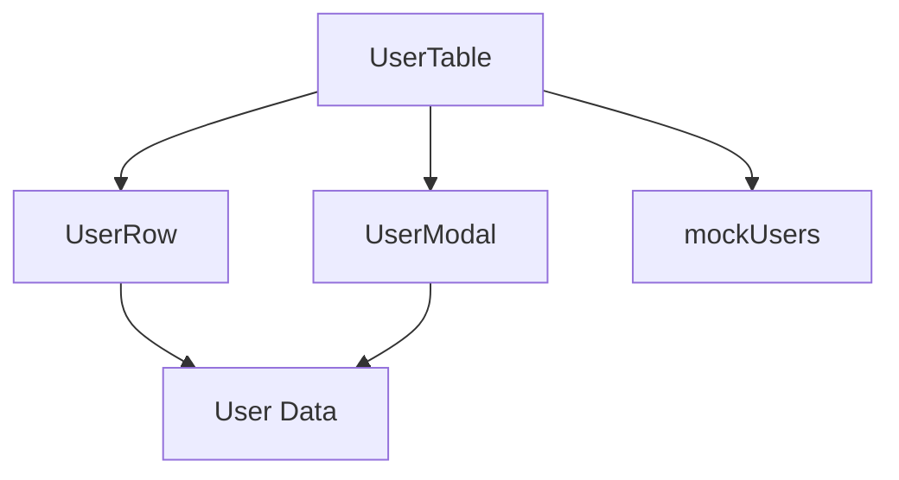

## Overview

GIMA provides a complete set of components for managing users in the system. These components work together to provide CRUD operations (Create, Read, Update, Delete) for user management.

## UserTable

The main container component that displays a table of users with search functionality and CRUD operations.

### Props

This component has no props - it manages its own state internally.

### Features

- **Search Functionality**: Filter users by name, email, or department
- **User List Display**: Shows all users in a formatted table
- **Create New Users**: Button to open modal for creating users
- **Edit Users**: Inline edit functionality for each user
- **Delete Users**: Remove users from the system
- **State Management**: Uses React hooks (`useState`) to manage:
  - User list (initialized from `mockUsers`)
  - Search query
  - Modal open/closed state
  - Currently editing user

### Import

```typescript
import UserTable from '@/components/user/UserTable';
```

### Usage Example

```typescript
export default function UserManagementPage() {
  return (
    <div className="bg-gray-50">
      <UserTable />
    </div>
  );
}
```

### State Structure

```typescript
const [users, setUsers] = useState<User[]>(mockUsers);
const [busqueda, setBusqueda] = useState('');
const [modalAbierto, setModalAbierto] = useState(false);
const [usuarioEditando, setUsuarioEditando] = useState<User | null>(null);
```

### Key Functions

<Accordion title="eliminarUsuario(id: string)">
Removes a user from the list by filtering out the user with the matching ID.

```typescript
const eliminarUsuario = (id: string) => {
  const nuevosUsuarios = users.filter(user => user.id !== id);
  setUsers(nuevosUsuarios);
};
```
</Accordion>

<Accordion title="abrirModalNuevo()">
Opens the modal for creating a new user by clearing the editing user state.

```typescript
const abrirModalNuevo = () => {
  setUsuarioEditando(null);
  setModalAbierto(true);
};
```
</Accordion>

<Accordion title="abrirModalEditar(user: User)">
Opens the modal for editing an existing user.

```typescript
const abrirModalEditar = (user: User) => {
  setUsuarioEditando(user);
  setModalAbierto(true);
};
```
</Accordion>

<Accordion title="guardarUsuario(userData: any)">
Saves a user (either creates new or updates existing based on `usuarioEditando` state).

```typescript
const guardarUsuario = (userData: any) => {
  if (usuarioEditando) {
    // Update existing user
    setUsers(users.map(u =>
      u.id === usuarioEditando.id
        ? { ...userData, id: usuarioEditando.id }
        : u
    ));
  } else {
    // Create new user
    const nuevoUsuario: User = {
      ...userData,
      id: Date.now().toString(),
    };
    setUsers([...users, nuevoUsuario]);
  }
  cerrarModal();
};
```
</Accordion>

### Search Filter

The component filters users based on name, email, or department:

```typescript
const usuariosFiltrados = users.filter(user =>
  user.name.toLowerCase().includes(busqueda.toLowerCase()) ||
  user.email.toLowerCase().includes(busqueda.toLowerCase()) ||
  user.department.toLowerCase().includes(busqueda.toLowerCase())
);
```

## UserRow

A row component that displays individual user information in the table.

### Props

<ParamField path="user" type="User" required>
  The user object to display in the row
</ParamField>

<ParamField path="onEliminar" type="(id: string) => void" required>
  Callback function to delete the user by ID
</ParamField>

<ParamField path="onEditar" type="(user: User) => void" required>
  Callback function to edit the user
</ParamField>

### Interface

```typescript
interface UserRowProps {
  user: User;
  onEliminar: (id: string) => void;
  onEditar: (user: User) => void;
}
```

### Import

```typescript
import UserRow from '@/components/user/UserRow';
```

### Usage Example

```typescript
<tbody className="divide-y divide-gray-200">
  {usuariosFiltrados.map(user => (
    <UserRow
      key={user.id}
      user={user}
      onEliminar={eliminarUsuario}
      onEditar={abrirModalEditar}
    />
  ))}
</tbody>
```

### Display Features

- **Avatar with Initials**: Shows user initials in a circular badge
- **User Info**: Displays name and email
- **Role**: Shows the user's role
- **Department**: Displays department with a styled badge
- **Status Badge**: Shows "available" or "unavailable" with color coding (green/red)
- **Action Buttons**: Edit and Delete buttons

### Styling

- Avatar: `#F0FDFA` background with `#0B2545` text color
- Status badges: Green (`bg-green-100 text-green-800`) for available, Red (`bg-red-100 text-red-800`) for unavailable
- Hover effect on table row: `hover:bg-gray-50`

## UserModal

A modal dialog component for creating and editing users.

### Props

<ParamField path="isOpen" type="boolean" required>
  Controls whether the modal is visible
</ParamField>

<ParamField path="onClose" type="() => void" required>
  Callback function to close the modal
</ParamField>

<ParamField path="onSave" type="(user: any) => void" required>
  Callback function to save the user data
</ParamField>

<ParamField path="user" type="User | null" required>
  The user to edit (null for creating a new user)
</ParamField>

### Interface

```typescript
interface UserModalProps {
  isOpen: boolean;
  onClose: () => void;
  onSave: (user: any) => void;
  user: User | null;
}
```

### Import

```typescript
import UserModal from '@/components/user/UserModal';
```

### Usage Example

```typescript
<UserModal
  isOpen={modalAbierto}
  onClose={cerrarModal}
  onSave={guardarUsuario}
  user={usuarioEditando}
/>
```

### Form Fields

The modal includes the following fields:

1. **Nombre** (Name) - Required text input
2. **Email** - Required email input
3. **Rol** (Role) - Dropdown with options:
   - Administrador
   - Técnico
   - Supervisor
   - Desarrollador
4. **Departamento** (Department) - Dropdown with options:
   - Infraestructura
   - Laboratorios
   - Desarrollo
   - Soporte
   - Marketing
   - Finanzas
5. **Estado** (Status) - Dropdown with options:
   - Activo (Active)
   - Inactivo (Inactive)

### State Management

```typescript
const [nombre, setNombre] = useState('');
const [email, setEmail] = useState('');
const [rol, setRol] = useState('Administrador');
const [departamento, setDepartamento] = useState('Infraestructura');
const [estado, setEstado] = useState<User['status']>('available');
```

### Auto-generated Initials

The modal automatically generates user initials from the name:

```typescript
const iniciales = nombre
  .split(' ')
  .map(palabra => palabra[0])
  .join('')
  .toUpperCase()
  .substring(0, 2);
```

### Form Submission

```typescript
const handleSubmit = (e: React.FormEvent) => {
  e.preventDefault();
  const nuevoUsuario = {
    nombre,
    email,
    rol,
    departamento,
    estado,
    iniciales,
  };
  onSave(nuevoUsuario);
};
```

### Modal Modes

- **Create Mode**: When `user` prop is `null`, form fields are empty and modal title is "Nuevo usuario"
- **Edit Mode**: When `user` prop has a value, form fields are pre-filled and modal title is "Editar usuario"

### Effect Hook

The modal uses `useEffect` to populate fields when editing:

```typescript
useEffect(() => {
  if (user) {
    setNombre(user.name);
    setEmail(user.email);
    setRol(user.rol);
    setDepartamento(user.department);
    setEstado(user.status);
  } else {
    // Reset form for new user
    setNombre('');
    setEmail('');
    setRol('Administrador');
    setDepartamento('Infraestructura');
    setEstado('available');
  }
}, [user, isOpen]);
```

## Component Relationships



## Related Documentation

<CardGroup cols={2}>
  <Card title="User Type" icon="code" href="/api/types/user">
    View the User interface and type definitions
  </Card>
  <Card title="User Management Feature" icon="users" href="/features/user-management">
    Learn about user management workflows
  </Card>
  <Card title="Data Service" icon="database" href="/api/services/data-service">
    User data management utilities
  </Card>
  <Card title="User Management Guide" icon="book" href="/guides/authentication">
    Authentication and user roles guide
  </Card>
</CardGroup>
