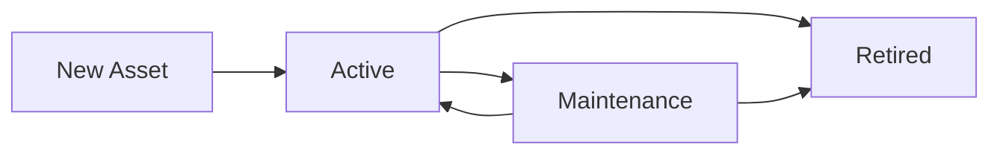

## Overview

GIMA's asset management system helps you track and organize equipment, vehicles, furniture, and other organizational resources. This guide covers the complete lifecycle of asset management from creation to tracking.

## Understanding Asset Categories

Assets in GIMA are organized by categories. The system comes with predefined categories that you can customize:

### Default Categories

<CardGroup cols={2}>
  <Card title="COMPUTO" icon="laptop">
    **CAT-001**
    
    Laptops, Desktops, Servidores y Periféricos
    
    Total assets: 120
  </Card>
  
  <Card title="MOBILIARIO" icon="chair">
    **CAT-002**
    
    Sillas ergonómicas, Escritorios y Archivos
    
    Total assets: 45
  </Card>
  
  <Card title="VEHÍCULOS" icon="truck">
    **CAT-003**
    
    Flota de transporte y vehículos de carga
    
    Total assets: 12
  </Card>
  
  <Card title="REDES" icon="network-wired">
    **CAT-004**
    
    Routers, Switches y Cableado estructurado
    
    Total assets: 85
  </Card>
</CardGroup>

## Accessing Asset Management

<Steps>
  <Step title="Navigate to Assets section">
    From the dashboard, click **"Activos"** in the sidebar (line 32 of Sidebar.tsx).
    
    This takes you to `/categorias-activos` where you can:
    - View all asset categories
    - Search and filter assets
    - Create new categories
    - Manage existing assets
  </Step>
  
  <Step title="Understand the interface">
    The assets page displays:
    
    **Header section:**
    - Page title: "CATEGORÍAS" (line 75)
    - Subtitle: "Clasificación de equipos" (line 78)
    - "Volver a configuración" back button (line 80)
    
    **Action buttons:**
    - Filter button with Filter icon (line 93)
    - "NUEVA CATEGORÍA" button to create categories (line 97)
  </Step>
</Steps>

## Creating a New Asset Category

<Steps>
  <Step title="Click 'Nueva Categoría'">
    Click the blue **"NUEVA CATEGORÍA"** button in the top right:
    - Background: `bg-gima-blue` with brightness effect on hover
    - Features a Plus icon with stroke width of 3
    - Has shadow effect: `shadow-lg shadow-blue-500/30`
  </Step>
  
  <Step title="Fill in category details">
    Enter the following information:
    
    **ID:** Unique category identifier (e.g., CAT-005)
    
    **Nombre:** Category name in all caps (e.g., "ELECTRÓNICA")
    
    **Descripción:** Detailed description of what this category includes
    
    **Activos:** Initial count (defaults to 0 for new categories)
  </Step>
  
  <Step title="Save the category">
    Click "Guardar" to create the category. It will appear in the main table with:
    - Unique ID in the first column
    - Bold category name (line 159)
    - Description text (line 162)
    - Asset count badge in blue (line 166)
    - Edit and delete action buttons (line 172)
  </Step>
</Steps>

<Tip>
  Use descriptive category names that match your organization's asset taxonomy. This makes searching and filtering much easier.
</Tip>

## Searching and Filtering Categories

### Using the Search Bar

The search functionality (line 108-119) allows you to find categories quickly:

<Steps>
  <Step title="Locate the search bar">
    Find the search input in the toolbar section:
    - Has a Search icon on the left (line 110)
    - Placeholder: "Buscar categoría..."
    - Styled with `bg-slate-50` and rounded corners
  </Step>
  
  <Step title="Enter search terms">
    Type any of the following to filter:
    - Category name (e.g., "COMPUTO")
    - Category ID (e.g., "CAT-001")
    
    The search is case-insensitive and filters in real-time.
  </Step>
  
  <Step title="View filtered results">
    The table updates automatically to show matching categories.
    
    The result count displays: "Total: X Resultados" (line 122)
  </Step>
</Steps>

### Filter Logic

```typescript
const filteredCategories = categories.filter(
  (cat) =>
    cat.name.toLowerCase().includes(searchTerm.toLowerCase()) ||
    cat.id.toLowerCase().includes(searchTerm.toLowerCase()),
);
```

The filter checks both the `name` and `id` fields, making it easy to find categories by either attribute.

## Understanding the Categories Table

The main table displays all categories with the following columns:

<Tabs>
  <Tab title="ID Column">
    **Category Identifier**
    
    - Font: medium weight, slate-500 color
    - Format: CAT-XXX (e.g., CAT-001)
    - Located in the first column (line 156)
    - Used for unique identification
  </Tab>
  
  <Tab title="Nombre Column">
    **Category Name**
    
    - Font: bold, navy color (`text-gima-navy`)
    - All uppercase format
    - Located in the second column (line 159)
    - Primary identifier users see
  </Tab>
  
  <Tab title="Descripción Column">
    **Description Text**
    
    - Font: regular, slate-500
    - Truncated with max-width for long text
    - Located in the third column (line 162)
    - Shows detailed category information
  </Tab>
  
  <Tab title="Activos Column">
    **Asset Count**
    
    - Badge style with `bg-blue-50` background
    - Blue text (`text-blue-700`)
    - Centered in column
    - Shows total number of assets in category (line 166)
  </Tab>
  
  <Tab title="Acciones Column">
    **Action Buttons**
    
    - Edit button (Pencil icon) - blue on hover
    - Delete button (Trash2 icon) - red on hover
    - Located in the rightmost column (line 170)
    - Appear in justified-end flex container
  </Tab>
</Tabs>

## Editing Asset Categories

<Steps>
  <Step title="Locate the category">
    Use the search bar or scroll through the table to find the category you want to edit.
  </Step>
  
  <Step title="Click the edit button">
    Click the **Pencil icon** in the Acciones column (line 172):
    - Hover color changes to gima-blue
    - Background changes to blue-50
    - Smooth transition animation
  </Step>
  
  <Step title="Update category information">
    Modify any of the fields:
    - Category name
    - Description
    - Asset count (if manually adjusting)
    
    <Warning>
      Changing the category ID may break existing asset associations. Only modify IDs if you're certain no assets are linked.
    </Warning>
  </Step>
  
  <Step title="Save changes">
    Click "Guardar" to update the category. The table refreshes with your changes.
  </Step>
</Steps>

## Deleting Asset Categories

<Steps>
  <Step title="Click the delete button">
    Click the **Trash2 icon** in the Acciones column (line 175):
    - Color: red-400 that changes to red-600 on hover
    - Background: red-50 on hover
    - Triggers the `handleDeleteClick` function (line 57)
  </Step>
  
  <Step title="Confirm deletion">
    A DeleteAlert modal appears (line 201) with:
    
    **Title:** "¿Eliminar Categoría?"
    
    **Description:** "Esta acción no se puede deshacer."
    
    **Actions:**
    - Cancel button - closes the modal
    - Confirm button - permanently deletes the category
  </Step>
  
  <Step title="Category removed">
    After confirmation:
    - The category is filtered out of the state array (line 63)
    - Table updates automatically
    - Asset count decreases in the header
  </Step>
</Steps>

<Warning>
  **Deletion is permanent!** Make sure you've moved or deleted all assets in a category before removing it. Consider archiving instead of deleting for audit trails.
</Warning>

## Working with Individual Assets

While the `/categorias-activos` page manages categories, individual assets are tracked within each category:

### Asset Properties

Each asset should include:

<ParamField path="id" type="string" required>
  Unique asset identifier (e.g., COMP-001-2024)
</ParamField>

<ParamField path="category" type="string" required>
  Category ID this asset belongs to (e.g., CAT-001)
</ParamField>

<ParamField path="name" type="string" required>
  Asset name or model (e.g., "Dell Latitude 5420")
</ParamField>

<ParamField path="description" type="string">
  Detailed description of the asset
</ParamField>

<ParamField path="location" type="string">
  Physical location or assignment
</ParamField>

<ParamField path="status" type="enum">
  Asset status: `active`, `maintenance`, `retired`
</ParamField>

<ParamField path="purchaseDate" type="date">
  Date of acquisition
</ParamField>

<ParamField path="value" type="number">
  Monetary value for accounting
</ParamField>

### Asset Lifecycle States



## Best Practices

<AccordionGroup>
  <Accordion title="Category Organization">
    - Use consistent naming conventions (all caps for categories)
    - Keep category descriptions detailed but concise
    - Limit the number of top-level categories (5-10 is optimal)
    - Create subcategories for complex asset types
    - Review and consolidate categories quarterly
  </Accordion>
  
  <Accordion title="Asset Tracking">
    - Assign unique IDs immediately upon asset acquisition
    - Include purchase date and value for depreciation tracking
    - Update asset status promptly when changes occur
    - Link assets to responsible users or departments
    - Photograph assets for identification purposes
  </Accordion>
  
  <Accordion title="Search and Filter">
    - Use the search bar before scrolling through long lists
    - Combine category filters with search terms
    - Bookmark frequently accessed categories
    - Export filtered lists for reporting
    - Save common search criteria as views
  </Accordion>
  
  <Accordion title="Data Quality">
    - Validate asset data at entry
    - Conduct regular asset audits (quarterly recommended)
    - Remove duplicate entries
    - Standardize location names
    - Keep descriptions updated with configuration changes
  </Accordion>
</AccordionGroup>

## Integration with Other Modules

Assets connect to other GIMA features:

<CardGroup cols={2}>
  <Card title="Maintenance Scheduling" icon="calendar" href="/guides/scheduling-maintenance">
    Link assets to preventive and corrective maintenance tasks
  </Card>
  
  <Card title="AI Diagnostics" icon="robot" href="/guides/using-ai-assistant">
    Use AI to diagnose asset issues and recommend solutions
  </Card>
  
  <Card title="Reporting" icon="chart-line" href="/guides/generating-reports">
    Generate asset utilization and depreciation reports
  </Card>
  
  <Card title="User Management" icon="users" href="/guides/authentication">
    Assign asset responsibility to specific users and departments
  </Card>
</CardGroup>

## Troubleshooting

<AccordionGroup>
  <Accordion title="Category not appearing in list">
    - Check if search filters are active
    - Verify the category was saved successfully
    - Refresh the page to reload data
    - Check browser console for errors
  </Accordion>
  
  <Accordion title="Cannot delete category">
    - Ensure the category has no associated assets
    - Verify you have admin permissions
    - Check if the category is set as default
    - Try reassigning assets to another category first
  </Accordion>
  
  <Accordion title="Asset count incorrect">
    - Manually trigger a count recalculation
    - Check for orphaned assets (assets without valid category)
    - Verify deleted assets are properly removed from counts
    - Review audit logs for discrepancies
  </Accordion>
</AccordionGroup>

## Next Steps

<CardGroup cols={3}>
  <Card title="Schedule Maintenance" icon="wrench" href="/guides/scheduling-maintenance">
    Set up maintenance schedules for your assets
  </Card>
  
  <Card title="Generate Reports" icon="file-text" href="/guides/generating-reports">
    Create asset inventory and utilization reports
  </Card>
  
  <Card title="Configure Settings" icon="settings" href="/configuration/overview">
    Customize asset categories and fields
  </Card>
</CardGroup>