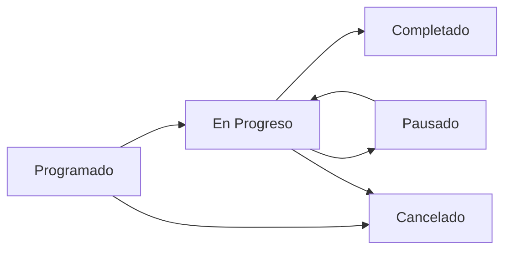

## Overview

GIMA's maintenance scheduling system helps you plan preventive maintenance, track corrective repairs, and ensure your assets remain operational. This guide covers creating maintenance schedules, assigning tasks, and monitoring completion.

## Accessing Maintenance Management

<Steps>
  <Step title="Navigate to Maintenance">
    From the dashboard, click **"Mantenimiento"** in the sidebar (line 36 of Sidebar.tsx):
    - Icon: Wrench (from lucide-react)
    - Route: `/mantenimiento`
    - Active state: white background with navy text
  </Step>
  
  <Step title="View maintenance dashboard">
    The maintenance section displays:
    - Scheduled maintenance tasks
    - Pending maintenance requests
    - Maintenance history
    - Asset maintenance status
    - Technician assignments
  </Step>
</Steps>

## Types of Maintenance

GIMA supports multiple maintenance workflows:

<Tabs>
  <Tab title="Preventive Maintenance">
    **Scheduled regular maintenance** to prevent failures:
    
    **Characteristics:**
    - Time-based or usage-based triggers
    - Planned in advance
    - Lower priority than corrective
    - Often recurring (daily, weekly, monthly)
    
    **Examples:**
    - Monthly air conditioning filter cleaning
    - Quarterly server hardware inspection
    - Annual vehicle service
    - Weekly equipment calibration
    
    **Benefits:**
    - Reduces unexpected failures
    - Extends asset lifetime
    - Lower overall costs
    - Predictable scheduling
  </Tab>
  
  <Tab title="Corrective Maintenance">
    **Repairs after failure** or issue detection:
    
    **Characteristics:**
    - Reactive response to problems
    - Unplanned work
    - Higher priority
    - One-time execution
    
    **Examples:**
    - Network equipment failure repair
    - Computer hardware replacement
    - Building maintenance emergency
    - Equipment malfunction fix
    
    **Best Practices:**
    - Document root cause
    - Update asset status immediately
    - Track downtime duration
    - Review if preventive could have helped
  </Tab>
  
  <Tab title="Predictive Maintenance">
    **AI-assisted early detection** of potential issues:
    
    **Characteristics:**
    - Uses AI diagnostics (see asistencia/page.tsx)
    - Data-driven predictions
    - Proactive scheduling
    - Optimized timing
    
    **Integration:**
    - Uses the AI Assistant diagnostic tab (line 67-75)
    - Analyzes symptom descriptions
    - Suggests maintenance actions
    - Predicts failure probability
    
    **How to Use:**
    1. Navigate to AI Assistant (from reportes, line 56)
    2. Switch to "Diagnóstico" tab
    3. Describe symptoms in the textarea (line 121)
    4. Click "Analizar Falla" with Sparkles icon (line 123)
  </Tab>
  
  <Tab title="Condition-Based">
    **Maintenance triggered by asset condition**:
    
    **Triggers:**
    - Sensor readings exceed thresholds
    - Performance degradation detected
    - Visual inspection findings
    - Usage metrics reach limits
    
    **Configuration:**
    - Set condition monitoring parameters
    - Define alert thresholds
    - Assign automatic task creation
    - Link to asset sensors
  </Tab>
</Tabs>

## Creating a Maintenance Task

<Steps>
  <Step title="Start new maintenance task">
    Click the **"+ Nueva Tarea"** or similar button in the maintenance interface:
    - Typically styled like other primary actions (`bg-gima-blue`)
    - Features a Plus icon
    - Opens the task creation form
  </Step>
  
  <Step title="Select the asset">
    Choose which asset requires maintenance:
    
    **Asset Selection:**
    - Search by asset name or ID
    - Filter by category (COMPUTO, MOBILIARIO, etc.)
    - View asset location and current status
    - See maintenance history for context
    
    <Tip>
      Reference the asset categories from `/categorias-activos` to ensure you're selecting the correct equipment.
    </Tip>
  </Step>
  
  <Step title="Define maintenance details">
    Fill in the maintenance task information:
    
    **Task Title:** Brief description (e.g., "Monthly AC Filter Cleaning")
    
    **Type:** Select from:
    - Preventiva (Preventive)
    - Correctiva (Corrective)
    - Predictiva (Predictive)
    - Por condición (Condition-based)
    
    **Priority:** Set urgency level:
    - Baja (Low) - routine maintenance
    - Media (Medium) - scheduled but important
    - Alta (High) - critical maintenance
    - Urgente (Urgent) - emergency response
    
    **Description:** Detailed work to be performed
  </Step>
  
  <Step title="Schedule the maintenance">
    Set timing and recurrence:
    
    **Start Date:** When maintenance should begin
    
    **Estimated Duration:** Time needed to complete
    
    **Recurrence (for preventive):**
    - No repetir (One-time)
    - Diaria (Daily)
    - Semanal (Weekly)
    - Mensual (Monthly)
    - Trimestral (Quarterly)
    - Anual (Annual)
    
    **End Date (for recurring):** When to stop the schedule
  </Step>
  
  <Step title="Assign personnel">
    Select who will perform the maintenance:
    
    **Technician Selection:**
    - Choose from users with "Técnico" role
    - View technician availability
    - Check current workload
    - Assign multiple technicians if needed
    
    **Department Assignment:**
    - Infraestructura
    - Laboratorios
    - Desarrollo
    - Soporte
    
    Reference: User roles from `/types/user.ts` and `/configuracion/User`
  </Step>
  
  <Step title="Add additional information">
    Optional but recommended fields:
    
    **Required Parts/Repuestos:**
    - Link to inventory items
    - Specify quantities needed
    - Check availability before scheduling
    
    **Estimated Cost:**
    - Labor costs
    - Parts and materials
    - External contractor fees
    
    **Safety Notes:**
    - Required PPE
    - Shutdown procedures
    - Risk assessments
    
    **Attachments:**
    - Maintenance procedures
    - Equipment manuals
    - Previous maintenance reports
  </Step>
  
  <Step title="Save and activate">
    Click **"Guardar"** to create the maintenance task:
    - Task appears in maintenance calendar
    - Assigned technicians receive notifications
    - Asset status updates to show pending maintenance
    - For recurring tasks, all instances are generated
  </Step>
</Steps>

## Using AI for Maintenance Diagnostics

The AI Assistant can help diagnose issues before scheduling maintenance:

<Steps>
  <Step title="Access AI Assistant">
    Navigate to the AI Assistant:
    - From Reports page: click "Asistencia IA" button (line 56-60 of reportes/page.tsx)
    - Direct route: `/asistencia`
    - The button has distinctive styling: `bg-gima-navy` with ring effect
  </Step>
  
  <Step title="Select Diagnóstico tab">
    Click the **"Diagnóstico"** tab (line 67-75 of asistencia/page.tsx):
    - Features a Zap (lightning) icon
    - Border color changes to gima-navy when active
    - Scales up slightly when selected (`scale-105`)
  </Step>
  
  <Step title="Describe the problem">
    In the diagnostic interface:
    
    **Wrench icon** indicates diagnostic mode (line 118)
    
    **Heading:** "Diagnóstico Inteligente" (line 119)
    
    **Textarea:** Describe symptoms (line 121):
    - Placeholder: "Ej: el aire acondicionado hace ruido metalico..."
    - Styled with `bg-[#E8EEEF]` background
    - 40 rows height for detailed descriptions
    - Focus ring in gima-blue
  </Step>
  
  <Step title="Analyze the fault">
    Click **"Analizar Falla"** button (line 122):
    - Blue background (`bg-gima-blue`)
    - Features Sparkles icon for AI indication
    - Shadow effect: `shadow-xl shadow-gima-blue/20`
    - Active scale animation
    
    The AI will:
    - Analyze the symptom description
    - Identify likely causes
    - Suggest diagnostic steps
    - Recommend maintenance actions
    - Estimate urgency level
  </Step>
  
  <Step title="Create maintenance from diagnosis">
    Based on AI recommendations:
    - Pre-fill maintenance task with AI insights
    - Auto-set priority based on urgency analysis
    - Include diagnostic report as attachment
    - Link to relevant asset documentation
  </Step>
</Steps>

<Tip>
  The AI diagnostic feature is especially useful for:
  - Unusual equipment behavior
  - Intermittent problems
  - Complex multi-system issues
  - Training new technicians
</Tip>

## Tracking Maintenance Status

Once maintenance is scheduled, you can track its progress:

### Maintenance States

<Tabs>
  <Tab title="Programado (Scheduled)">
    **Initial state** after creation:
    - Awaiting start date
    - Assigned technician notified
    - Parts requisitioned
    - Asset reserved for maintenance window
    
    **Actions Available:**
    - Edit task details
    - Reschedule
    - Reassign technician
    - Cancel task
  </Tab>
  
  <Tab title="En Progreso (In Progress)">
    **Active maintenance** work:
    - Technician started the task
    - Asset marked as unavailable
    - Timer tracking duration
    - Updates can be logged
    
    **Actions Available:**
    - Add progress notes
    - Upload photos
    - Request additional parts
    - Pause task
    - Complete task
  </Tab>
  
  <Tab title="Pausado (Paused)">
    **Temporarily stopped**:
    - Awaiting parts
    - Awaiting approval
    - External dependency
    - Shift ended
    
    **Required:**
    - Pause reason
    - Expected resume time
    - Current state notes
  </Tab>
  
  <Tab title="Completado (Completed)">
    **Finished maintenance**:
    - Work verified
    - Asset returned to service
    - Documentation uploaded
    - Time and cost logged
    
    **Post-Completion:**
    - Asset status updates to "Active"
    - Generates completion report
    - Updates maintenance history
    - Schedules next preventive (if recurring)
  </Tab>
  
  <Tab title="Cancelado (Cancelled)">
    **Maintenance not performed**:
    - No longer needed
    - Asset retired
    - Duplicate task
    - Incorrect scheduling
    
    **Required:**
    - Cancellation reason
    - Approval (for urgent tasks)
  </Tab>
</Tabs>

## Maintenance Calendar View

Visualize your maintenance schedule:

<Tabs>
  <Tab title="Daily View">
    Shows all tasks for the selected day:
    - Hour-by-hour breakdown
    - Technician availability
    - Asset conflicts
    - Urgent priorities highlighted
  </Tab>
  
  <Tab title="Weekly View">
    7-day overview:
    - Task distribution across days
    - Workload balance
    - Upcoming preventive maintenance
    - Color-coded by type
  </Tab>
  
  <Tab title="Monthly View">
    Full month calendar:
    - All scheduled tasks
    - Recurring maintenance patterns
    - Department assignments
    - Budget tracking by period
  </Tab>
</Tabs>

## Best Practices

<AccordionGroup>
  <Accordion title="Scheduling Strategy">
    - Schedule preventive maintenance during low-usage periods
    - Bundle related maintenance tasks to minimize asset downtime
    - Allow buffer time between tasks for overruns
    - Consider seasonal factors (weather, business cycles)
    - Balance technician workload across the team
    - Schedule critical asset maintenance with backup coverage
  </Accordion>
  
  <Accordion title="Documentation">
    - Photograph equipment before and after maintenance
    - Record all parts replaced with serial numbers
    - Document any deviations from standard procedures
    - Note unexpected findings for future reference
    - Update asset configuration if changes made
    - Store receipts and warranties
  </Accordion>
  
  <Accordion title="Parts Management">
    - Check parts availability before scheduling
    - Order long-lead items in advance
    - Maintain minimum stock of critical spares
    - Track parts usage for cost analysis
    - Link parts to specific assets via `/configuracion/repuestos`
    - Document part numbers in maintenance notes
  </Accordion>
  
  <Accordion title="Communication">
    - Notify asset users before maintenance begins
    - Update stakeholders on progress
    - Report delays immediately
    - Document completion and any issues
    - Share lessons learned with team
    - Use the Chat feature in AI Assistant for quick questions
  </Accordion>
</AccordionGroup>

## Integration with Other Features

<CardGroup cols={2}>
  <Card title="Asset Management" icon="box" href="/guides/managing-assets">
    Link maintenance to specific assets and categories
  </Card>
  
  <Card title="AI Assistant" icon="robot" href="/guides/using-ai-assistant">
    Use AI diagnostics to inform maintenance decisions
  </Card>
  
  <Card title="Reports" icon="chart-bar" href="/guides/generating-reports">
    Generate maintenance performance and cost reports
  </Card>
  
  <Card title="User Management" icon="users" href="/guides/authentication">
    Assign tasks to technicians and track performance
  </Card>
</CardGroup>

## Troubleshooting

<AccordionGroup>
  <Accordion title="Cannot schedule maintenance">
    - Check if asset is already reserved for maintenance
    - Verify technician availability during requested time
    - Ensure you have scheduling permissions (Supervisor or Admin)
    - Check for conflicting maintenance tasks
  </Accordion>
  
  <Accordion title="Maintenance not appearing in calendar">
    - Refresh the calendar view
    - Check date range filters
    - Verify task was saved successfully
    - Look in correct calendar view (daily/weekly/monthly)
  </Accordion>
  
  <Accordion title="Technician not receiving notifications">
    - Verify technician user status is 'available'
    - Check notification settings in `/configuracion/notificaciones`
    - Confirm technician email is correct
    - Review system notification logs
  </Accordion>
</AccordionGroup>

## Next Steps

<CardGroup cols={3}>
  <Card title="Use AI Assistant" icon="sparkles" href="/guides/using-ai-assistant">
    Leverage AI for diagnostics and recommendations
  </Card>
  
  <Card title="Generate Reports" icon="file-chart-line" href="/guides/generating-reports">
    Create maintenance performance reports
  </Card>
  
  <Card title="Configure Notifications" icon="bell" href="/configuration/notifications">
    Set up alerts for maintenance tasks
  </Card>
</CardGroup>